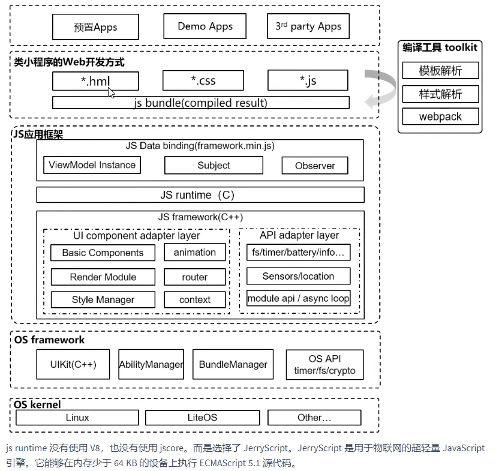
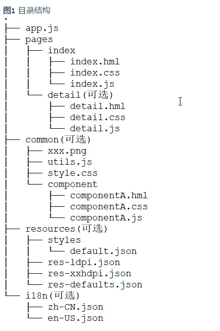

# GobangGame
鸿蒙2.0TV大屏基于js模板实现五子棋游戏

## JS应用开发框架
[JS UI框架](https://developer.harmonyos.com/cn/docs/documentation/doc-guides/ui-js-overview-0000000000500376)是一种跨设备的高性能UI开发框架,支持声明式编程和跨设备多态UI

### 简介
js应用开发框架，提供了一套跨平台的类web应用开发框架，通过Toolkit将开发者编写的htl,css和js文件编译打包成js bundle,解析运行js bundle,
生成native ui view组件树并进行渲染显示。通过支持三方开发者使用声明式的api进行应用开发，以数据驱动试图变化，避免大量的视图操作，大大降低
应用开发难度，提升开发者开发体验。

js应用框架实现主要包括：
- native: 使用c++进行编写，是框架主体部分
- javascript: 提供js应用框架对用户js文件的运行时支持，并通过向引擎暴露一些全局的方法和对象，支撑js运行时与native框架之间的交互

### 基础能力
- 声明式编程
- 跨设备
- 高性能

### 整体框架

js ui框架包括了应用层(Application)，前端框架层(Framework)，引擎层(Engine)和平台适配层(Porting Layer)

## 文件组织

### 目录结构
js fa应用的js模块`entry/src/main/js/module`的典型开发目录结构：
- app.js文件用于全局js逻辑和应用生命周期管理
- pages目录用于存放所有组件页面
- common存放公共资源文件
- resources存放资源配置
- i18n配置多语言场景

**i18n和resources是开发保留文件夹，不可以重名**

### 应用资源访问规则
本开发框架中绝对路径以‘/’开头，相对路径以‘./’或者‘../’

- 代码文件，需相对路径
- 引用资源文件，推荐绝对路径
- 公共代码和资源文件推荐放在common下
- css样式文件通过url()函数创建<url>数据类型，如 url(/common/xxx.png)

**当代码文件a应用代码文件b时，若处于不同目录，b引用资源文件时必须绝对路径**

### 存储目录定义
应用使用`文件存储接口`访问文件时，可以通过使用特定scheme来访问预定义的一些文件存取目录。不同设备上对应的实际位置不同。

| 目录类型     | 路径前缀          | 访问可见性   | 说明                                           |
| ------------ | ----------------- | ------------ | ---------------------------------------------- |
| 临时目录     | internal://cache/ | 仅本应用可见 | 可读写，随时可清除。一般用作下载临时目录或缓存 |
| 应用私有目录 | internal://app/   | 仅本应用可见 | 随应用卸载删除                                 |
| 外部存储     | internal://share/ | 所有应用可见 | 随应用卸载删除。其他应用在有相应权限可读写     |

### config.json配置
js标签中包含了实例名称，页面路由和窗口样式信息
| 标签 | 类型 | 默认值 | 必填 | 描述 |
| -------- | ------------ | ------- | ----- | ----------- |
| name | string | default | yes | 标识js实例名字 |
| pages | array | - | yes | 路由信息 |
| window | object | - | no | 窗口信息 |

